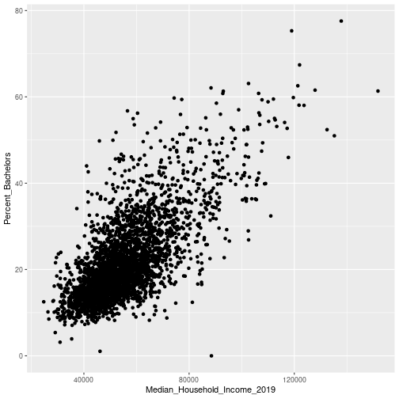
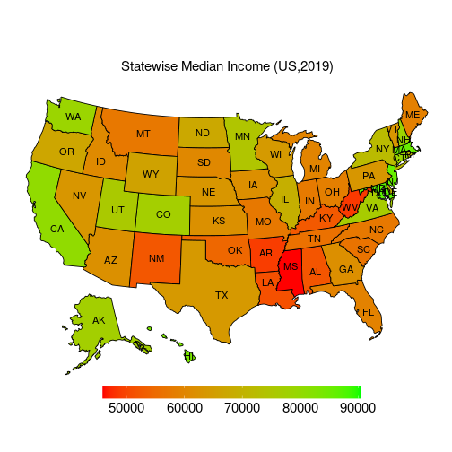
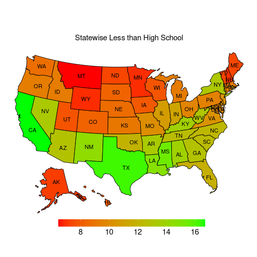
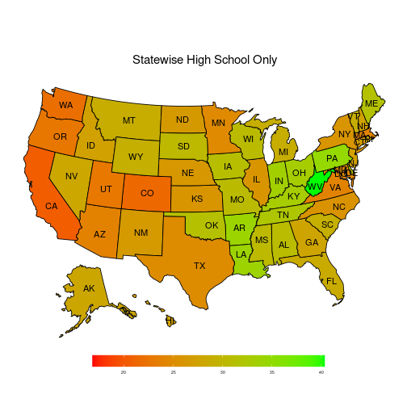
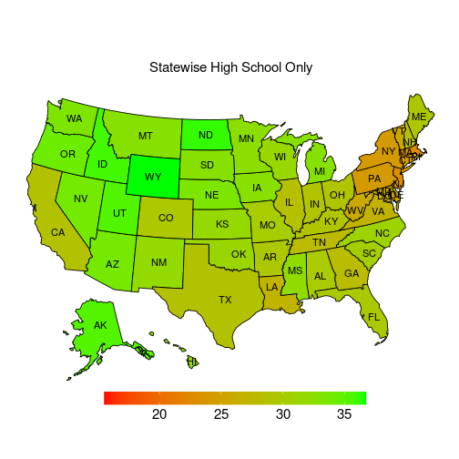

#Loading the packages

```r
library(tidyverse)
library(readr)
library(readxl)
library(reactable)
```


```r
Enrollment_dataset <- read_csv("dataset/public-vs-private-enrollment-county-2019.csv") 
```

```
## 
## ── Column specification ──────────────────────────────────────────────────────────────────
## cols(
##   County = col_character(),
##   FIPS = col_character(),
##   Year = col_character(),
##   Grade = col_character(),
##   `School Type` = col_character(),
##   `Measure Type` = col_character(),
##   Variable = col_character(),
##   Value = col_double()
## )
```


```r
Unemployment_dataset <- read_excel("dataset/Unemployment.xlsx", range = "A5:CN3201")
Education_dataset <- read_excel("dataset/Education.xlsx", range = "A5:AU3209")
```


```r
income_table <- Unemployment_dataset %>%
  select("FIPS_Code","Area_name","Median_Household_Income_2019")
```


```r
edu_table <- Education_dataset %>%
  select(c(1),c(3),c(44:47))%>%
  rename("FIPS_Code" = c(1), "Area_name" = c(2), "Percent_No_Diploma" = c(3), "Percent_Diploma" = c(4), "Percent_Associates" = c(5),"Percent_Bachelors" = c(6))
```


```r
inc_edu_state <- merge(x = income_table, y = edu_table, by = "FIPS_Code")%>%
  select(-c(4))%>%
  filter(endsWith(FIPS_Code,"000"))

inc_edu_county <- merge(x = income_table, y = edu_table, by = "FIPS_Code")%>%
  select(-c(4))%>%
  filter(!endsWith(FIPS_Code,"000"))
```

Graphs and Linear Models:


```r
ggplot(inc_edu_county,aes(Median_Household_Income_2019,Percent_Bachelors))+
  geom_point()
```

```
## Warning: Removed 3 rows containing missing values (geom_point).
```



```r
income_bach_model <- lm(Median_Household_Income_2019~Percent_Bachelors,data=inc_edu_county)
summary(income_bach_model)
```

```
## 
## Call:
## lm(formula = Median_Household_Income_2019 ~ Percent_Bachelors, 
##     data = inc_edu_county)
## 
## Residuals:
##    Min     1Q Median     3Q    Max 
## -39801  -6408   -618   5773  56468 
## 
## Coefficients:
##                   Estimate Std. Error t value Pr(>|t|)    
## (Intercept)       32019.20     454.23   70.49   <2e-16 ***
## Percent_Bachelors  1078.28      18.95   56.90   <2e-16 ***
## ---
## Signif. codes:  0 '***' 0.001 '**' 0.01 '*' 0.05 '.' 0.1 ' ' 1
## 
## Residual standard error: 10170 on 3139 degrees of freedom
##   (3 observations deleted due to missingness)
## Multiple R-squared:  0.5077,	Adjusted R-squared:  0.5076 
## F-statistic:  3238 on 1 and 3139 DF,  p-value: < 2.2e-16
```


```r
income_no_diploma_model <- lm(Median_Household_Income_2019~Percent_No_Diploma,data=inc_edu_county)
summary(income_no_diploma_model)
```

```
## 
## Call:
## lm(formula = Median_Household_Income_2019 ~ Percent_No_Diploma, 
##     data = inc_edu_county)
## 
## Residuals:
##    Min     1Q Median     3Q    Max 
## -27915  -7802  -2544   4779  87778 
## 
## Coefficients:
##                    Estimate Std. Error t value Pr(>|t|)    
## (Intercept)        71367.01     511.23  139.60   <2e-16 ***
## Percent_No_Diploma -1199.23      35.31  -33.96   <2e-16 ***
## ---
## Signif. codes:  0 '***' 0.001 '**' 0.01 '*' 0.05 '.' 0.1 ' ' 1
## 
## Residual standard error: 12390 on 3139 degrees of freedom
##   (3 observations deleted due to missingness)
## Multiple R-squared:  0.2687,	Adjusted R-squared:  0.2685 
## F-statistic:  1153 on 1 and 3139 DF,  p-value: < 2.2e-16
```


```r
percent_bach_no_diploma_model <- lm(Percent_No_Diploma~Percent_Bachelors,data=inc_edu_county)
summary(percent_bach_no_diploma_model)
```

```
## 
## Call:
## lm(formula = Percent_No_Diploma ~ Percent_Bachelors, data = inc_edu_county)
## 
## Residuals:
##     Min      1Q  Median      3Q     Max 
## -13.305  -3.563  -0.586   2.705  52.354 
## 
## Coefficients:
##                    Estimate Std. Error t value Pr(>|t|)    
## (Intercept)       21.614064   0.224779   96.16   <2e-16 ***
## Percent_Bachelors -0.389598   0.009378  -41.55   <2e-16 ***
## ---
## Signif. codes:  0 '***' 0.001 '**' 0.01 '*' 0.05 '.' 0.1 ' ' 1
## 
## Residual standard error: 5.032 on 3139 degrees of freedom
##   (3 observations deleted due to missingness)
## Multiple R-squared:  0.3548,	Adjusted R-squared:  0.3546 
## F-statistic:  1726 on 1 and 3139 DF,  p-value: < 2.2e-16
```


```r
percent_bach_no_diploma_model <- lm(Percent_No_Diploma~Percent_Bachelors,data=inc_edu_county)
summary(percent_bach_no_diploma_model)
```

```
## 
## Call:
## lm(formula = Percent_No_Diploma ~ Percent_Bachelors, data = inc_edu_county)
## 
## Residuals:
##     Min      1Q  Median      3Q     Max 
## -13.305  -3.563  -0.586   2.705  52.354 
## 
## Coefficients:
##                    Estimate Std. Error t value Pr(>|t|)    
## (Intercept)       21.614064   0.224779   96.16   <2e-16 ***
## Percent_Bachelors -0.389598   0.009378  -41.55   <2e-16 ***
## ---
## Signif. codes:  0 '***' 0.001 '**' 0.01 '*' 0.05 '.' 0.1 ' ' 1
## 
## Residual standard error: 5.032 on 3139 degrees of freedom
##   (3 observations deleted due to missingness)
## Multiple R-squared:  0.3548,	Adjusted R-squared:  0.3546 
## F-statistic:  1726 on 1 and 3139 DF,  p-value: < 2.2e-16
```


```r
plot(inc_edu_county[, 3:7], main = "Correlation plot")
```

-1.png)

```r
par(mfrow = c(1, 1))
```


```r
library (usmap)
St_Pop <- inc_edu_state[order(inc_edu_state$Area_name),]
St_Pop <- St_Pop[!(St_Pop$Area_name == "United States"),]
St_Pop$fips <- statepop$fips
St_Pop$abbr <- statepop$abbr

St_Pop <- St_Pop %>% 
  rename(Income = Median_Household_Income_2019) %>% 
  rename(Less_than_High_School = `Percent_No_Diploma`) %>% 
  rename ( High_School_Only = `Percent_Diploma`) %>% 
  rename(College_or_Associate = `Percent_Associates`) %>% 
  rename(Bachelors = `Percent_Bachelors`)
```


```r
#anti_join(countypop, Ct_Pop, by = "fips")
Ct_Pop <- inc_edu_county[order(inc_edu_county$Area_name),]
Ct_Pop <- Ct_Pop[order(Ct_Pop$FIPS_Code),]
Ct_Pop <- na.omit(Ct_Pop)
temp1 <- countypop
temp2 <- temp1[!(temp1$fips == "15005"),]
Ct_Pop$fips <- temp2$fips
Ct_Pop$abbr <- temp2$abbr
Ct_Pop <- Ct_Pop %>% 
  rename(Income = Median_Household_Income_2019) %>% 
  rename(Less_than_High_School = `Percent_No_Diploma`) %>% 
  rename ( High_School_Only = `Percent_Diploma`) %>% 
  rename(College_or_Associate = `Percent_Associates`) %>% 
  rename(Bachelors = `Percent_Bachelors`)
```


```r
plot_usmap(data = St_Pop,
           values = "Income",
           labels = TRUE) +
  scale_fill_gradient(low = "red",
                      high = 'green',
                      name = NULL) +
  ggtitle("Statewise Median Income (US,2019)") +
  theme(plot.title = element_text(size = 15,
                                  hjust = 0.5)) +
  theme(legend.position = c(0.2,-0.1),
        legend.direction = 'horizontal',
        legend.key.width = unit(0.8,"in"),
        legend.key.height = unit(0.2,"in"),
        legend.text = element_text(size = 15))
```




```r
plot_usmap(data = St_Pop,
           values = "Less_than_High_School",
           labels = TRUE) +
  scale_fill_gradient(low = "red",
                      high = 'green',
                      name = NULL) +
  ggtitle("Statewise Less than High School") +
  theme(plot.title = element_text(size = 15,
                                  hjust = 0.5)) +
  theme(legend.position = c(0.2,-0.1),
        legend.direction = 'horizontal',
        legend.key.width = unit(0.8,"in"),
        legend.key.height = unit(0.2,"in"),
        legend.text = element_text(size = 15))
```




```r
plot_usmap(data = St_Pop,
           values = "High_School_Only",
           labels = TRUE) +
  scale_fill_gradient(low = "red",
                      high = 'green',
                      name = NULL) +
  ggtitle("Statewise High School Only") +
  theme(plot.title = element_text(size = 15,
                                  hjust = 0.5)) +
  theme(legend.position = c(0.2,-0.1),
        legend.direction = 'horizontal',
        legend.key.width = unit(0.8,"in"),
        legend.key.height = unit(0.2,"in"),
        legend.text = element_text(size = 05))
```




```r
plot_usmap(data = St_Pop,
           values = "College_or_Associate",
           labels = TRUE) +
  scale_fill_gradient(low = "red",
                      high = 'green',
                      name = NULL) +
  ggtitle("Statewise High School Only") +
  theme(plot.title = element_text(size = 15,
                                  hjust = 0.5)) +
  theme(legend.position = c(0.2,-0.1),
        legend.direction = 'horizontal',
        legend.key.width = unit(0.8,"in"),
        legend.key.height = unit(0.2,"in"),
        legend.text = element_text(size = 15))
```



